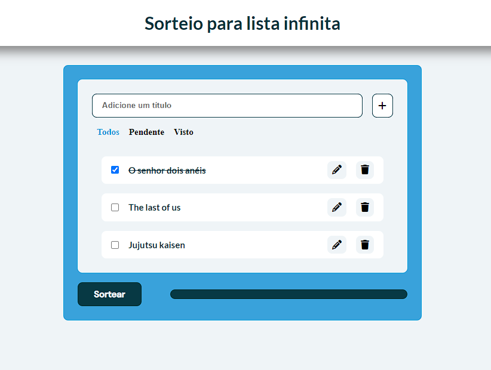

<h1 align="center"> Lista infinita </h1>

Quando eu e minha namorada encontrávamos algo para assistir juntos, nós anotávamos em uma lista no bloco de notas e assim essa lista só aumentava. Além disso, somos um pouco indecisos em escolher algo, então decidi criar um site onde podemos não só anotar o que assistir, mas também sortear um nome entre eles. 
Eu espero que esse projeto possa ser útil para alguém, assim como foi pra gente. 🤝🏽

  <a href="#-tecnologias">Tecnologias</a>&nbsp;&nbsp;&nbsp;|&nbsp;&nbsp;&nbsp;
  <a href="#-projeto">Projeto</a>&nbsp;&nbsp;&nbsp;|&nbsp;&nbsp;&nbsp;
  <a href="#-layout">Layout</a>

 

  

## 🚀 Tecnologias

Esse projeto foi desenvolvido com as seguintes tecnologias:

- HTML e CSS
- JavaScript
- Git e Github

## 💻 Projeto

A Lista infinita é um app para ajudar a registrar títulos em uma lista e também sortear um entre eles.

- [Visite o projeto online](https://gabrielmelo29.github.io/Game_Mania)

---

Feito com ♥ by Gabriel Melo
